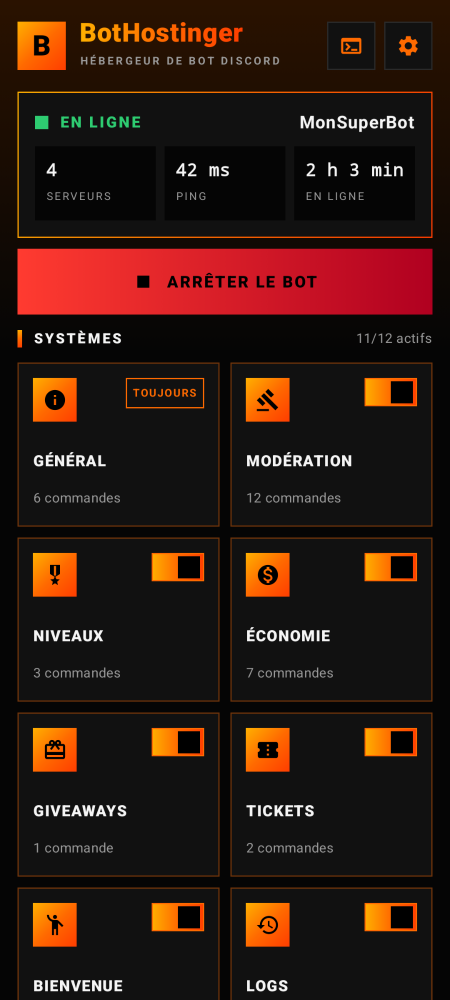
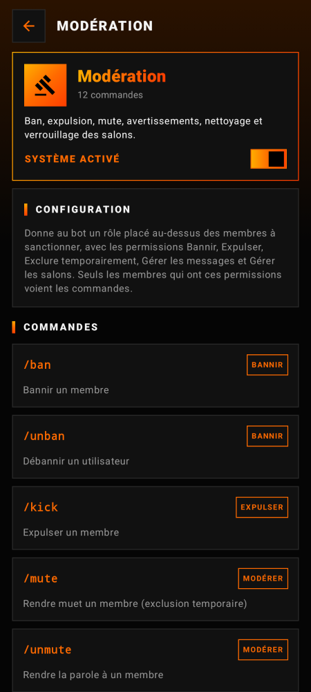
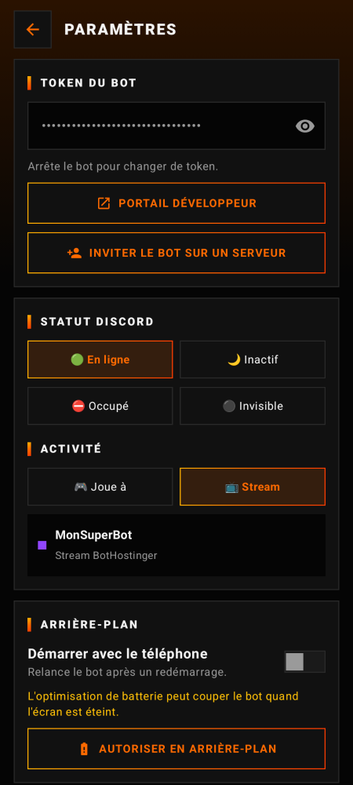
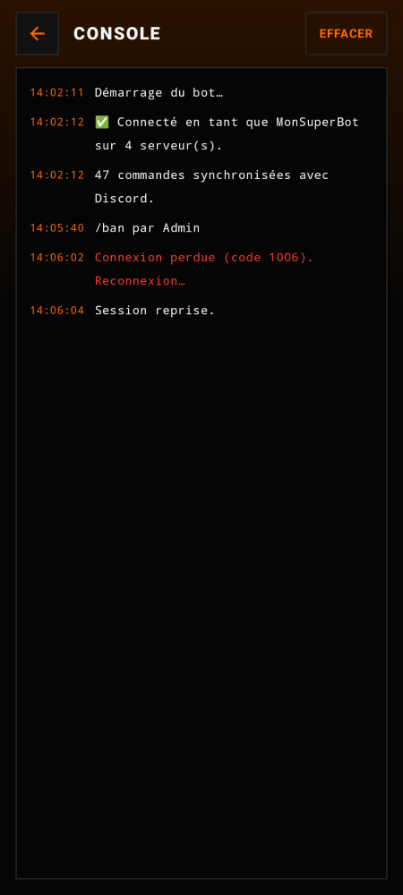

# BotHostinger ⚡

Application Android (**.apk**) qui héberge **gratuitement** un bot Discord complet directement sur ton téléphone.
Tu colles le token de ton bot, tu appuies sur **Lancer**, et c'est parti : le téléphone garde le bot en ligne.

Tout le monde a le **même bot complet**, avec 12 systèmes et plus de 45 commandes slash, activables ou non depuis l'app.
Tous les bots hébergés affichent le statut **« Joue à BotHostinger »** ou **« Stream BotHostinger »**.

<p>
  
  
  
  
</p>

## Les systèmes du bot

| Système | Commandes |
|---|---|
| **Général** (toujours actif) | `/aide` `/ping` `/botinfo` `/serveur` `/utilisateur` `/avatar` |
| **Modération** | `/ban` `/unban` `/kick` `/mute` `/unmute` `/clear` `/warn` `/warns` `/resetwarns` `/slowmode` `/lock` `/unlock`, avec MP au membre sanctionné et logs |
| **Niveaux** | XP en discutant (anti-spam 1 min), annonces de niveau, `/rank`, `/classement`, rôles récompenses (`/niveaux`) |
| **Économie** | `/solde` `/daily` (avec série de jours) `/travail` `/payer` `/parier` `/richesse` `/eco-admin` |
| **Giveaways** | `/giveaway lancer / terminer / relancer`, bouton « Participer », tirage automatique même après un redémarrage |
| **Tickets** | `/ticket-panel` publie un bouton qui crée un salon privé (membre + staff), `/ticket fermer / ajouter / retirer` |
| **Bienvenue** | `/bienvenue`, `/aurevoir`, `/autorole`, variables `{user}` `{mention}` `{server}` `{count}` |
| **Logs** | `/logs salon` : sanctions, arrivées, départs et tickets dans un salon privé |
| **Suggestions** | `/suggestion`, votes 👍/👎, boutons Accepter/Refuser pour le staff |
| **Rôles** | `/roles-boutons` : jusqu'à 10 rôles à prendre ou enlever d'un clic |
| **Fun** | `/8ball` `/pile-ou-face` `/de` `/choisir` `/pfc` `/blague` |
| **Utilitaire** | `/sondage` (sondages natifs Discord), `/rappel`, `/dire` |

Les commandes du staff n'apparaissent qu'aux membres qui ont la permission correspondante.
Les données (XP, argent, avertissements, giveaways…) sont enregistrées sur le téléphone, séparément pour chaque serveur.

## Télécharger l'APK

L'APK est construit automatiquement par GitHub Actions à chaque push :

1. Va dans l'onglet **Actions** du dépôt, puis ouvre le dernier run **Build APK**.
2. En bas, dans **Artifacts**, télécharge **BotHostinger-apk**.
3. Sur le téléphone, ouvre `BotHostinger.apk` et autorise l'installation depuis des sources inconnues.

Pour publier une release, crée un tag `v1.0.0` : l'APK sera attaché à la release GitHub.

## Créer ton bot Discord

1. Sur <https://discord.com/developers/applications>, clique sur **New Application**.
2. Dans l'onglet **Bot**, clique sur **Reset Token** et colle le token dans l'app (Paramètres).
3. Toujours dans **Bot**, active **SERVER MEMBERS INTENT**. C'est nécessaire pour la bienvenue, l'autorôle et les logs d'arrivée. Sans lui, le bot marche quand même : ces fonctions sont juste mises en pause.
4. Lance le bot, puis appuie sur **Inviter le bot sur un serveur**.

## Conseils

- Dans les paramètres, appuie sur **Autoriser en arrière-plan**. Sinon, certains téléphones (Xiaomi, Huawei, Samsung…) coupent le bot quand l'écran est éteint.
- Le bot est en ligne **tant que le téléphone est allumé et connecté à Internet**.

## Compiler soi-même

Prérequis : JDK 17 ou plus et le SDK Android (API 35).

```bash
./gradlew testReleaseUnitTest   # 26 tests : faux Gateway + fausse API Discord
./gradlew assembleRelease       # → app/build/outputs/apk/release/app-release.apk
```

## Structure

```
app/src/main/java/com/bothostinger/app/
├── bot/
│   ├── DiscordGateway.kt   # WebSocket Discord : identify, heartbeat, resume, repli si intent refusé
│   ├── DiscordRest.kt      # API HTTP Discord + messages d'erreur compréhensibles
│   ├── Presence.kt         # statut « Joue à / Stream BotHostinger »
│   ├── BotService.kt       # service au premier plan qui garde le bot en ligne
│   ├── engine/             # moteur : commandes slash, interactions, boutons, embeds
│   └── modules/            # les 12 systèmes du bot
├── data/                   # réglages de l'app + base de données JSON par serveur
└── ui/                     # interface Jetpack Compose (noir et dégradé orange, tout carré)
```
