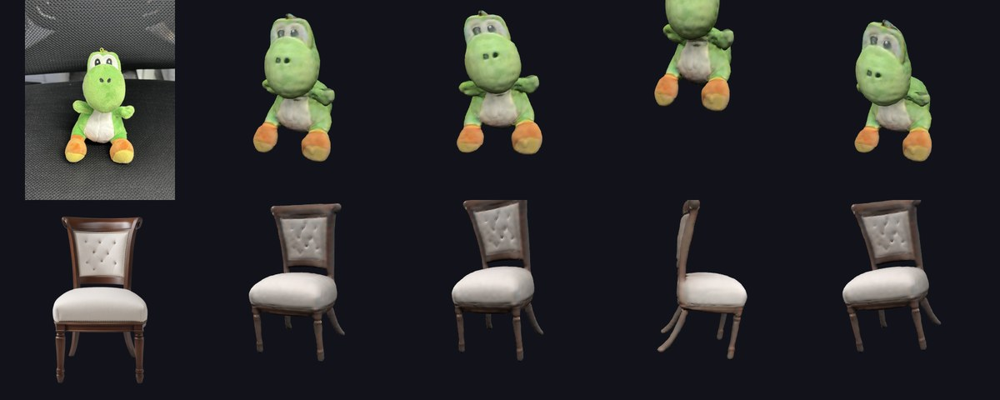

# Image 3D — une photo → un modèle 3D coloré et animé, 100 % sur le téléphone



*À gauche l'image d'origine, puis le modèle 3D généré par l'application : au repos, « Danser », « Sauter », « Onduler » (peluche) et « Gelée », « Rotation », « Dandiner » (chaise). Rendus par three.js à partir des fichiers `.glb` exportés.*

- **IA locale** : TripoSR (Stability AI & Tripo) tourne sur le processeur du téléphone avec ONNX Runtime. Aucun serveur, aucun compte, **aucune limite**.
- **Modèle complet** : l'IA reconstruit aussi l'arrière de l'objet, avec ses **couleurs**.
- **Détourage automatique** du fond (U²-Net), avec **aperçu avant génération** : tu vois exactement l'image que l'IA va recevoir (bascule « Vu par l'IA » / « Original »).
- **Aperçu 3D en direct** : un modèle grossier apparaît et tourne dès que l'IA a imaginé l'objet, pendant que la version détaillée se calcule.
- **Squelette automatique + 9 animations** : rotation, respirer, flotter, sauter, danser, dandiner, gelée, onduler, regarder.
- **Visionneuse 3D** : tourner au doigt, zoomer à deux doigts, vitesse réglable.
- **Export** dans Téléchargements/Image3D : **GLB animé** (Blender, Unity, Godot, Unreal…), **OBJ** coloré, **STL** pour l'impression 3D. Partage direct (Discord, Drive…).
- **Bibliothèque** de toutes tes créations, renommer, supprimer.
- La génération continue écran éteint (notification de progression, bouton Annuler).

## Installation sur le téléphone

1. Ouvre la page **Releases** du dépôt depuis ton téléphone et télécharge **`Image3D.apk`** (release « Image 3D — application Android »).
2. Installe-le (Android demande d'autoriser l'installation depuis le navigateur).
3. Au premier lancement, appuie sur **Installer l'IA** : environ **460 Mo** à télécharger **une seule fois** (reprise automatique si la connexion coupe, fichiers vérifiés par SHA-256).
4. C'est tout : ensuite l'application fonctionne **hors ligne**.

**Téléphone conseillé** : Android 10 ou plus, processeur 64 bits, **4 Go de RAM minimum** (6 Go ou plus pour la « Précision maximale »).

**Durée** : de ~30 s à quelques minutes selon le téléphone et le niveau de détail (Rapide 128³, Normal 192³, Détaillé 256³).

## Comment ça marche

```
photo ──► U²-Net (détourage) ──► recadrage 512×512 sur fond gris
      ──► encodeur TripoSR (DINO ViT + transformer)  ──► triplan 3×40×64×64
      ──► aperçu 3D rapide sur une grille 64³ (affiché pendant le calcul)
      ──► décodeur TripoSR interrogé sur une grille de 128³ à 256³ points ──► densité
      ──► surface nets ──► suppression des morceaux flottants ──► lissage de Taubin
      ──► décodeur interrogé sur chaque sommet ──► couleurs
      ──► squelette vertical automatique (5 os) ──► animations
```

Pour tenir dans la mémoire d'un téléphone :
- l'encodeur est **quantifié en int8** (455 Mo au lieu de 1,7 Go, résultat visuellement identique) ;
- l'attention du transformer est **calculée par blocs** (pic mémoire ÷ 6) ;
- le modèle est au **format ORT** et ses poids sont lus **directement dans le fichier mappé en mémoire** (pas de copie en RAM).

## Structure

| Dossier | Contenu |
|---|---|
| `android/` | L'application (Kotlin, Jetpack Compose, OpenGL ES 3, ONNX Runtime) |
| `android/app/src/main/java/com/image3d/app/ai/` | Téléchargement des modèles, détourage, TripoSR, pipeline |
| `android/.../mesh/` | Surface nets, nettoyage, lissage, normales |
| `android/.../anim/` | Squelette automatique, animations, skinning |
| `android/.../export/` | Export GLB (validé par le validateur officiel Khronos), OBJ, STL |
| `android/.../render/` | Visionneuse 3D (skinning sur le GPU) |
| `tools/export_models.py` | Convertit TripoSR (PyTorch) en ONNX/ORT et vérifie le résultat |
| `tools/reference_pipeline.py` | Le même pipeline en Python, pour comparer et tester sur PC |

## Publier les fichiers de l'IA et l'APK (GitHub Actions)

Deux workflows sont fournis dans `.github/workflows/` :

- **`image3d-models.yml`** : télécharge TripoSR, l'exporte, et publie `triposr_encoder_int8.ort`, `triposr_encoder.ort`, `triposr_decoder.onnx`, `u2netp.onnx` et `manifest.json` dans la release **`image3d-models-v1`**. C'est l'adresse que l'application utilise par défaut. Il se lance tout seul quand le script d'export change, ou à la main (onglet *Actions* → *Run workflow*).
- **`image3d-apk.yml`** : lance les tests, compile l'APK et le publie dans la release **`image3d-app`**.

> Sur un dépôt *fork*, GitHub désactive les Actions par défaut : va dans l'onglet **Actions** et clique sur **« I understand my workflows, go ahead and enable them »**.

**Mises à jour de l'application** : par défaut l'APK est signé avec une clé de debug générée par GitHub, qui peut changer d'une compilation à l'autre (il faudrait alors désinstaller avant de mettre à jour). Pour une clé fixe, crée un keystore et ajoute ces secrets au dépôt : `IMAGE3D_KEYSTORE_BASE64` (le fichier `.jks` en base64), `IMAGE3D_KEYSTORE_PASSWORD`, `IMAGE3D_KEY_ALIAS`, `IMAGE3D_KEY_PASSWORD`.

**Autre source** : dans l'application, *Modèles d'IA → Options avancées*, tu peux changer l'adresse de téléchargement (tout dossier web contenant `manifest.json` et les fichiers), ou **importer les fichiers** depuis le stockage du téléphone.

## Compiler soi-même

```bash
# Modèles (Python 3.11, ~16 Go de RAM conseillés)
cd image-to-3d/tools
git clone --depth 1 https://github.com/VAST-AI-Research/TripoSR.git
pip install torch==2.14.0 --index-url https://download.pytorch.org/whl/cpu
pip install -r requirements.txt
python export_models.py --triposr-src TripoSR --out models
python reference_pipeline.py TripoSR/examples/chair.png --models models --encoder triposr_encoder_int8.ort --out out

# Application (JDK 17 + SDK Android 35)
cd ../android
./gradlew testDebugUnitTest assembleRelease
# Test du vrai pipeline d'IA sur PC (même code Kotlin que sur le téléphone) :
./gradlew testDebugUnitTest --tests '*RealModel*' -Dimage3d.models=../tools/models -Dimage3d.image=../tools/out/input.png
```

## Limites connues

- Un seul objet par image ; les scènes complètes (paysages, pièces) ne sont pas le point fort de TripoSR.
- Les animations reposent sur une chaîne d'os verticale : elles plient, tordent et font rebondir l'objet, mais ne savent pas qu'un personnage a des bras ou des jambes (pas de marche « bipède »).
- Couleurs par sommet (pas de texture) : les petits détails de couleur dépendent du niveau de détail choisi.

## Licences

- TripoSR — Stability AI & Tripo AI — MIT
- U²-Net (u2netp) — Xuebin Qin et al. — Apache 2.0
- ONNX Runtime — Microsoft — MIT
